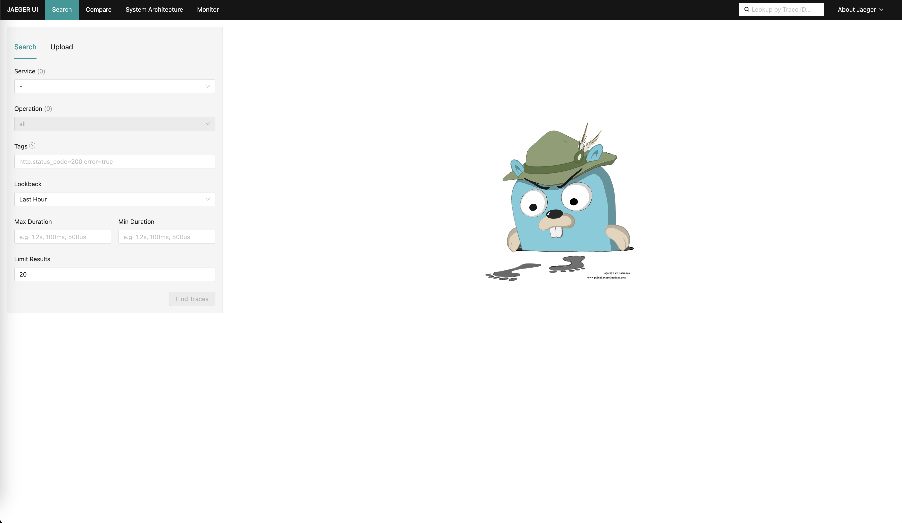
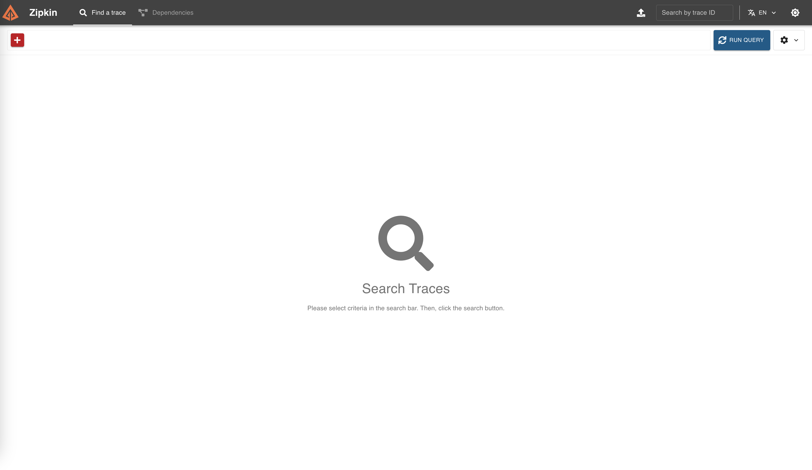
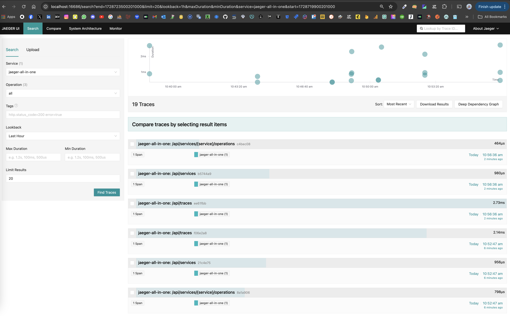
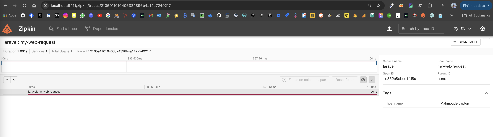
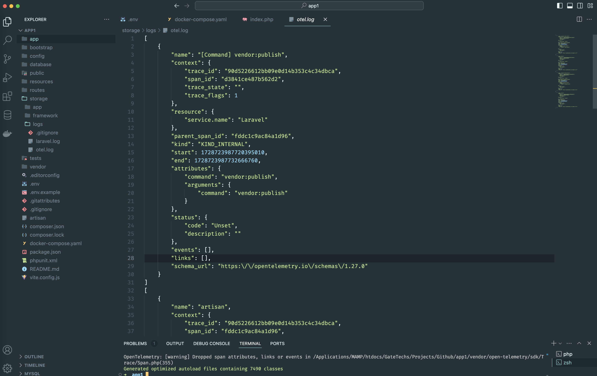
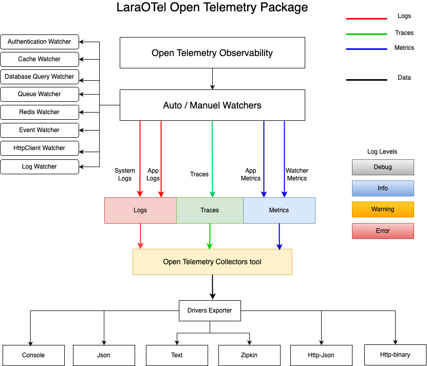

# LaraOTel OpenTelemetry Laravel Package

[](https://packagist.org/packages/laraotel/opentelemetry-laravel)
[](https://github.com/Mahmoud-Italy/laraotel-opentelemetry-laravel/blob/2.x/LICENSE.md)

This package provides a simple way to use Telemetry From [OpenTelemetry](https://opentelemetry.io/) OTel into your Laravel application to Measure performance across jobs and services, database queries, events etc..

## Introduction
[OpenTelemetry](https://opentelemetry.io/), or OTel for short, is an Observability tools designed to create and manage telemetry data such as [traces](https://opentelemetry.io/docs/concepts/signals/traces/), [metrics](https://opentelemetry.io/docs/concepts/signals/metrics/) and [logs](https://opentelemetry.io/docs/concepts/signals/logs/), to collect information on how your entire system is behaving.

You can easily measure performance of a Laravel powered system. It can transmit the results to a tracing tool like Jaeger, Zikpin Or you can export data into Console, Json, text etc..

## Bundle Zikpin and Jaeger into your Application
To visualize traces exported from our application, we need to integrate open source tracing
tools [Zipkin](https://zipkin.io/) and [Jaeger](https://www.jaegertracing.io/) into our setup using docker.

First, we create a `docker-compose.yaml` file in the root of our project, with content as follows:

```yaml
version: '3.7'
services:
    zipkin:
        image: openzipkin/zipkin-slim
        ports:
            - "9411:9411"
    jaeger:
        image: jaegertracing/all-in-one
        environment:
            COLLECTOR_ZIPKIN_HOST_PORT: 9412

        ports:
            - "9412:9412"
            - "16686:16686"
```

Next, we pull in Zipkin and Jaeger by running `docker-compose up -d`.

We can confirm that Zipkin is up by navigating to `http://localhost:9411/` on our browser. For Jaeger, navigating
to `http://localhost:16686/` on our browser should display the Jaeger home page.




## Installation

You can install the package via composer:

```bash
composer require laraotel/opentelemetry-laravel:2.0.3
```

***Important Note: The [opentelemetry extension](https://opentelemetry.io/docs/zero-code/php/) must be enabled on your machine.***
## Usage

### Configuration

Publish the configuration file:

```bash
php artisan vendor:publish --provider="LaraOTel\OpenTelemetryLaravel\OpenTelemetryServiceProvider" --tag="config"
```

### Update the environment variables

You can find them in configuration file: `config/otel.php`.

### Register the middleware

you can register the middleware in the `app/Http/Kernel.php`:

```php
protected $middleware = [
    \LaraOTel\OpenTelemetryLaravel\Middlewares\MeasureRequest::class,
    // ...
];
```

In laravel 11 you can not register in the kernel.php the middlewares anymore. You can register your global middleware in `bootstrap/app.php`

```php
->withMiddleware(function (Middleware $middleware) {
    $middleware->append(\LaraOTel\OpenTelemetryLaravel\Middlewares\MeasureRequest::class);
})
```

or you can set the env variable `OTEL_AUTO_TRACE_REQUESTS` to `true` to enable it automatically.


### Watchers

This package provides some watchers to help you trace your application:

- `LaraOTel\OpenTelemetryLaravel\Watchers\AuthenticateWatcher` to trace authentications.
- `LaraOTel\OpenTelemetryLaravel\Watchers\CacheWatcher` to trace cache operations.
- `LaraOTel\OpenTelemetryLaravel\Watchers\DatabaseQueryWatcher` to trace database queries.
- `LaraOTel\OpenTelemetryLaravel\Watchers\QueueWatcher` to trace job execution.
- `LaraOTel\OpenTelemetryLaravel\Watchers\RedisWatcher` to trace redis operations.
- `LaraOTel\OpenTelemetryLaravel\Watchers\EventWatcher` to trace event opearations.
- `LaraOTel\OpenTelemetryLaravel\Watchers\HttpClientWatcher` to trace http client requests.
- `LaraOTel\OpenTelemetryLaravel\Watchers\LogWatcher` to trace log operations.

You can enable or disable them in the configuration file: `config/otel.php`.

### Custom span

You can create a custom span by using the `LaraOTel\OpenTelemetryLaravel\Facades\Measure` facade:

```php
use LaraOTel\OpenTelemetryLaravel\Facades\Measure;

Measure::span('my-web-request')->measure(function() {
    // ...
});
```

or manually start and end a span:

```php
Measure::start('my-web-request');

// ...

Measure::end();
```

and you can modify the span attributes by using a closure:

```php
Measure::start('my-web-request', function($span) {
    $span->setAttribute('key', 'value');
    // ...
});

// ...
Measure::end();
```

of course, you can get the span instance by using the `Measure::span()` method:

```php
$span = Measure::span('my-web-request');
$span->setAttribute('key', 'value');
$scope = $span->activate();

// ...

$span->end();
$scope->detach();
```





## Available Drivers
```php
'default' => env('OTEL_DEFAULT_TRACER', 'log'),

# available drivers: `console`, `log`, `text`, `zipkin`, `http-json`, `http-binary`, `grpc`.
'tracers' => [
    'console' => [
        'driver' => 'console',
        'transport' => 'stream',
        'span_exporter' => 'console',
    ],

    'log' => [
        'driver' => 'log',
        'transport' => 'stream',
        'span_exporter' => 'console',
        'endpoint' => storage_path('logs/otel.log'),
    ],

    'text' => [
        'driver' => 'text',
        'transport' => 'stream',
        'endpoint' => storage_path('logs/otel.text'),
    ],

    'zipkin' => [
        'driver' => 'zipkin',
        'transport' => 'http',
        'span_exporter' => 'otlp',
        'endpoint' => env('OTEL_EXPORTER_ZIPKIN_ENDPOINT', 'http://zipkin:9411/api/v2/spans'),
        'content_type' => 'application/json',
    ],

    'http-json' => [
        'driver' => 'http-json',
        'transport' => 'http',
        'span_exporter' => 'otlp',
        'endpoint' => env('OTEL_HTTP_JSON_ENDPOINT', 'http://localhost:9411/v1/traces'),
        'content_type' => 'application/json',
    ],

    'http-binary' => [
        'driver' => 'http-binary',
        'transport' => 'http',
        'span_exporter' => 'otlp',
        'endpoint' => env('OTEL_HTTP_BINARY_ENDPOINT', 'http://localhost:4318/v1/traces'),
        'content_type' => 'application/x-protobuf',
    ],
],
```

## Available Logs Level
```php
use LaraOTel\OpenTelemetryLaravel\Facades\Logger;

Logger::debug('my log message');
Logger::info('my log message');
Logger::warning('my log message');
Logger::error('my log message');
```

## UML Diagram of the package design


## Testing

```bash
composer test
```

## License
The MIT License (MIT). Please see [License File](LICENSE.md) for more information.